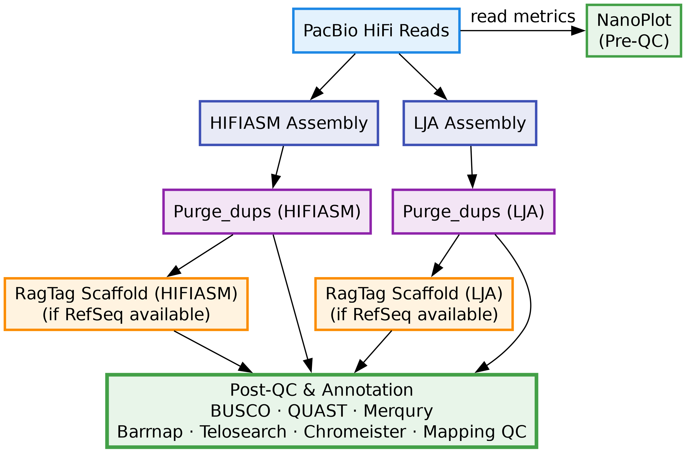

# snakemake_HiFi_assembly



Snakemake workflow for **de novo genome assembly from PacBio HiFi reads**, including
assembly, duplicate purging, reference-guided scaffolding, and extensive quality control.

This pipeline is modular, reproducible, and designed for execution on HPC systems
using Conda-managed environments.

---

##  Overview

The workflow performs the following steps per sample:

1. **HiFi assembly**
   - Hifiasm
   - LJA (optional / parallel)

2. **Mitochondrial contig detection**
   - OATK

3. **Duplicate purging**
   - purge_dups (HiFi and LJA)

4. **Reference-guided scaffolding (optional)**
   - RagTag
   - Sorting scaffolds by reference order

5. **Annotation & analysis**
   - Barrnap (rRNA)
   - TelosearchLR (telomeres)
   - Chromeister (assembly–reference comparison)

6. **Quality control**
   - BUSCO
   - QUAST
   - Merqury
   - Mapping QC
   - MultiQC summary

The pipeline supports **conditional execution of RagTag** based on a sample sheet flag.

---

##  Requirements

### Core requirements
- Linux
- Python ≥ 3.8
- Snakemake ≥ 7
- Conda / Mamba

All bioinformatics tools are installed automatically via Conda environments.

---

##  Repository Structure

```
snakemake_HiFi_assembly/
├── config/
│   ├── config.yaml
│   └── sample_sheet.tsv
├── workflow/
│   ├── Snakefile
│   ├── accessors.smk
│   ├── rules/
│   └── envs/
├── hifi_assembly_pipeline.png
└── README.md
```

---

##  Configuration

### `config/config.yaml`

```yaml
project_dir: "/path/to/project_directory"
sample_sheet: "config/sample_sheet.tsv"
```

---

##  Running the Workflow

```bash
snakemake --use-conda --cores 32 --configfile config/config.yaml
```

---

##  Software Used

Snakemake, hifiasm, LJA, purge_dups, RagTag, BUSCO, QUAST, Merqury, TelosearchLR,
Barrnap, Chromeister, MultiQC.

---

##  Contact

Verstrepen Lab — KU Leuven  
https://verstrepenlab.sites.vib.be/en  
Contact: **michael.abrouk@kuleuven.be**
